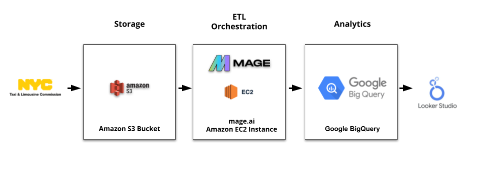
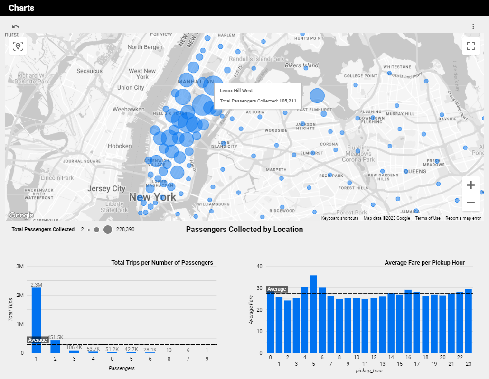
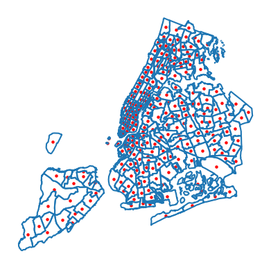
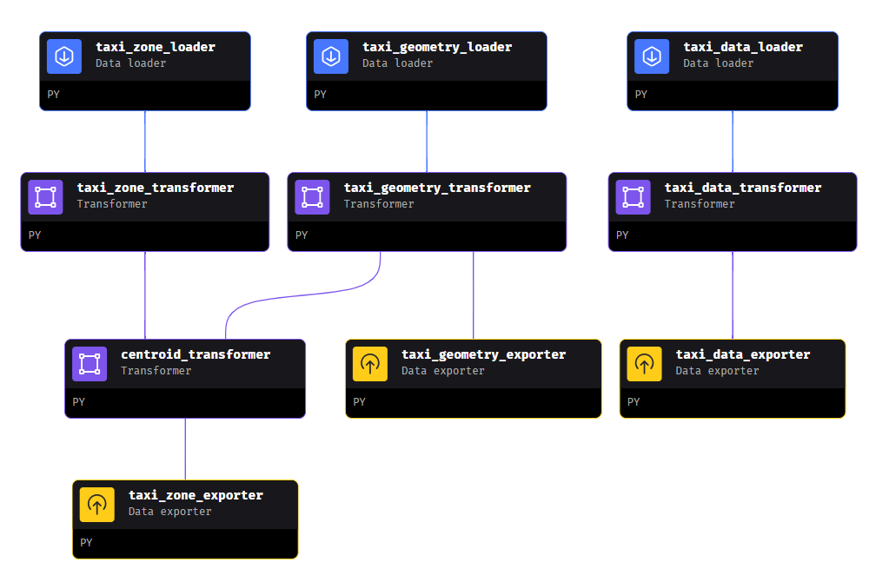
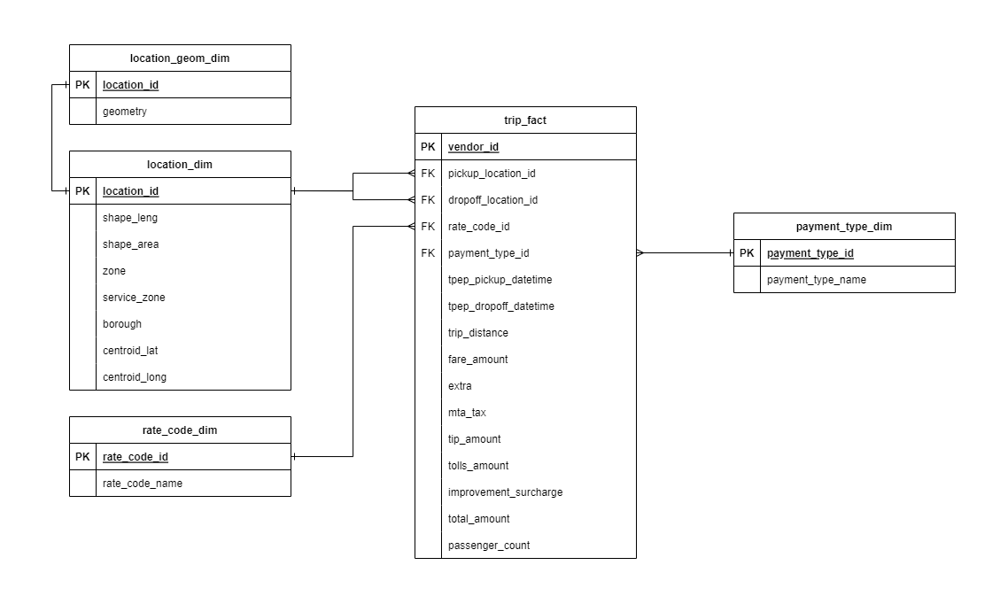

# NY Yellow Taxi Data Analysis Pipeline 

An end-to-end data engineering project using **S3**, **EC2**, **mage.ai** and **Google BigQuery**. The goal was to tranform data describing trips made by yellow taxis in New York into a suitable format for visualising in a **Looker Studio** dashboard. Data cleaning and transformation was conducted using Python and [GeoPandas](https://geopandas.org/en/stable/index.html).

[View the dashboard here](https://lookerstudio.google.com/s/sLjSE1DIzpw). A sample of the dashboard output can be seen below:

## About the Dataset

The New York City Taxi and Limousine Commission (TLC), founded in 1971, is the agency responsible for licensing and regulating New York City's medallion (yellow) taxis, street hail livery (green) taxis, for-hire vehicles (FHVs), commuter vans, and paratransit vehicles. 

In this project, to minimise cost, we limit the scope to **yellow taxi trips made in January 2023**. The data was sourced from the [TLC page on nyc.gov](https://www.nyc.gov/site/tlc/about/tlc-trip-record-data.page). The data dictionary can be found [here](https://www.nyc.gov/assets/tlc/downloads/pdf/data_dictionary_trip_records_yellow.pdf). This gives us 3066766 trip records to work with.

The TLC collects trip record information for each taxi and for-hire vehicle trip completed by its licensed vehicles. They receive taxi trip data from the technology service providers (TSPs) that provide electronic metering in each cab, and FHV trip data from the app, community livery, black car, or luxury limousine company, or base, who dispatched the trip.

In each trip record dataset, one row represents a single trip made by a TLC-licensed vehicle. Each of the trip records contains a field corresponding to the location of the pickup or drop-off of the trip (or in FHV records before 2017, just the pickup), populated by numbers ranging from 1-263. These numbers correspond to taxi zones, which may be downloaded as a table or map/shapefile and matched to the trip records. 

Note that the Taxi Zones are roughly based on NYC Department of City Planning’s Neighborhood Tabulation Areas (NTAs) and are meant to approximate neighborhoods, so you can see which neighborhood a passenger was picked up in, and which neighborhood they were dropped off in. 

## Exploratory Data Analysis

Initial EDA shows that the source data needs the following cleaning and transformations:

- Only 88 of the 3066766 trips have distances of over 100 miles. Some of these are anomalously large (258928 miles!) For simplicity and to prevent these from skewing dashboard visualisations, we cut these from the dataset.

- 13106 trips have a RateCode of `99`. This isn't described anywhere in the user guide or data dictionary, so we encode them as `Undefined`.

- The source data uses the EPSG:2263 coordinate reference system (CRS), known as the "NAD83 / New York Long Island (ftUS)" projection, used for mapping and geospatial data analysis in the New York Long Island region. However, Google BigQuery uses a specific geographic coordinate system for storing geometry data, which is based on the World Geodetic System 1984 (WGS 84) coordinate system. Because of this, we convert geometries to WGS 84 (EPSG:4326).

- The shape data shows the boundaries of zones, but Looker Studio map visualisations can only work with point coordinate pairs, so we calculate centroids (described below).

Detailed discussion can be found in the [`exploratory-data-analysis.ipynb`](./exploratory-data-analysis.ipynb) notebook.

## Architecture

To gain experience in moving data through and between different cloud service providers, we use components from both Amazon Web Services and Google Cloud:

### Storage

Trip data in parquet format, along with shp data desribing the boundaries of pickup/dropoff zones and csv data describing other attributes of these zones (such as their name and Borough) were pushed to an S3 bucket via the AWS CLI.

### ETL Orchestration

We transform the data using a [mage.ai](https://docs.mage.ai/introduction/overview) pipeline, hosted on an EC2 `t2.large` instance, which has read-only access to our bucket via its own IAM role. Mage is an Airflow-like pipeline orchestration tool, chosen for its low barrier to entry, specialised notebook UI and modular approach. We define separate data loaders, transformers and data exporters for our three data sources:

Code blocks for each pipeline step can be found in the [mage-pipeline](./mage-pipeline/) directory.

At time of writing, Looker Studio can't use coordinate or shape data to draw boundaries on map visualisations (although it can plot boundaries if given certain [geographic field types](https://support.google.com/looker-studio/answer/9843174?sjid=12070472207540925414-EU#zippy=%2Cin-this-article)), so we use `geopandas.GeoSeries.centroid` to find the coordinates of the centroid of each zone for Looker to use in map visualisations.

To make things more convenient for downstream consumers, we standardise column names to snake_case.

The pipeline's data exporter steps write to our BigQuery database via a dedicated Google Service account.

### Analytics

Our pipeline-transformed BigQuery database hs the following data model:

Since rate codes and payment types are unlikely to change during the duration of the project, we insert these into separate dimension tables. However, to reduce the number of joins which need to be made in Looker Studio, we create a dedicated `trip_analytics` table by joining the `trip_fact` table with the `rate_code_dim` and `payment_type_dim` tables on the appropriate IDs. Queries can be found in the [analytics-queries](./analytics-queries/) directory.

## Future work

- Add triggering to each pipeline step.
- Add more robust tests to each Mage code block. 
- Expand the timeframe covered by the data (depending on cost to do so).

## Related links

- [TLC trip record data on nyc.gov](https://www.nyc.gov/site/tlc/about/tlc-trip-record-data.page)
- [Yellow taxi trips data dictionary](https://www.nyc.gov/assets/tlc/downloads/pdf/data_dictionary_trip_records_yellow.pdf)
- [TLC trip record user guide](https://www.nyc.gov/assets/tlc/downloads/pdf/trip_record_user_guide.pdf)